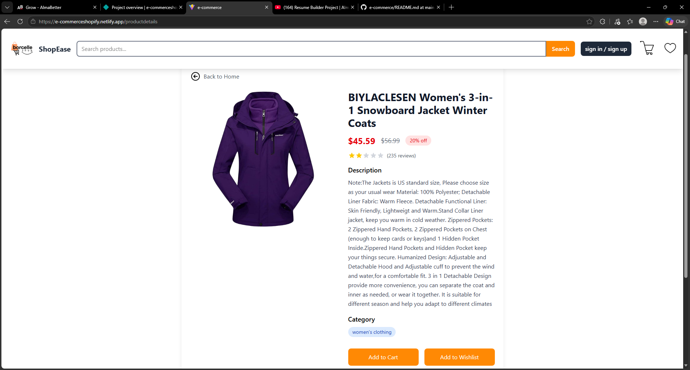
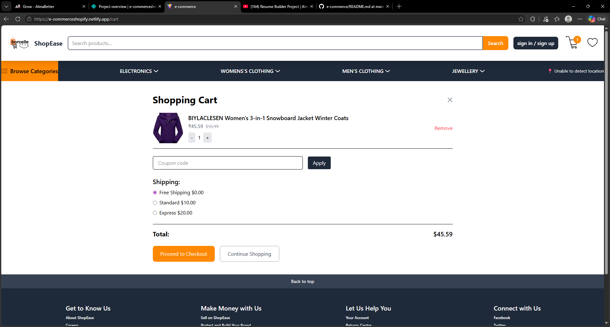
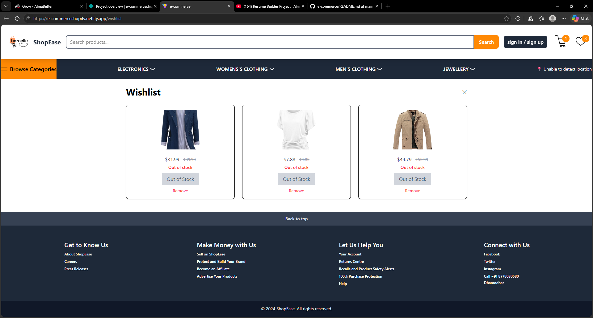

**E-commerce**

**Description:**: A React + Vite e-commerce website showcasing product listings, categories, cart, wishlist, and product details. Built with a component-based structure and unit tests.

**Features:**
- **Product listings:** Browse products by category.
- **Product detail:** View detailed product pages.
- **Cart & Wishlist:** Add/remove items, view totals.
- **Responsive UI:** Mobile-first layout with reusable components.
- **Tests:** Jest/React Testing Library unit tests under `src/__tests__`.

**Project Structure:**
- **Root files:** `package.json`, `vite.config.js`, `tailwind.config.js`, `babel.config.cjs`, `jest.config.cjs`
- **Public:** Static assets served by Vite.
- **src/**: Application source code
  - `App.jsx`: Root React component
  - `main.jsx`: App entry
  - `index.css`: Global styles
  - `action/`: Redux-like action creators (`action.js`, `actionType.js`)
  - `Components/`: Reusable UI components
    - `Banner.jsx`, `Form.jsx`, `ProductCard.jsx`, `Searchbar.jsx`
    - `categories/`: `Electronics.jsx`, `Jewellery.jsx`, `Mens.jsx`, `Womens.jsx`
    - `layout/`: `Footer.jsx`, `Header.jsx`, `Navbar.jsx`, `UserLocation.jsx`
  - `Pages/`: Route pages (`CartPage.jsx`, `Home.jsx`, `Product_Detail_Page.jsx`, `Wishlist.jsx`)
  - `reducer/`: Application reducer logic (`reducer.js`)
  - `__tests__/`: Jest tests for components and reducers

**Folder Structure (visual)**


**Folder Structure (text)**

```
E-commerce/
├─ package.json
├─ vite.config.js
├─ tailwind.config.js
├─ babel.config.cjs
├─ jest.config.cjs
├─ public/
├─ src/
│  ├─ App.jsx
│  ├─ main.jsx
│  ├─ index.css
│  ├─ action/
│  │  ├─ action.js
│  │  └─ actionType.js
│  ├─ Components/
│  │  ├─ Banner.jsx
│  │  ├─ Form.jsx
│  │  ├─ ProductCard.jsx
│  │  └─ Searchbar.jsx
│  │  ├─ categories/
│  │  │  ├─ Electronics.jsx
│  │  │  ├─ Jewellery.jsx
│  │  │  ├─ Mens.jsx
│  │  │  └─ Womens.jsx
│  │  └─ layout/
│  │     ├─ Footer.jsx
│  │     ├─ Header.jsx
│  │     ├─ Navbar.jsx
│  │     └─ UserLocation.jsx
│  ├─ Pages/
│  │  ├─ CartPage.jsx
│  │  ├─ Home.jsx
│  │  ├─ Product_Detail_Page.jsx
│  │  └─ Wishlist.jsx
│  ├─ reducer/
│  │  └─ reducer.js
│  └─ __tests__/
```

**Getting Started**

Prerequisites: Node.js (16+ recommended) and npm or Yarn.

1. Install dependencies

```bash
npm install
# or
# yarn
```

2. Run development server

```bash
npm run dev
# or
# yarn dev
```

3. Run tests

```bash
npm test
```

4. Build for production

```bash
npm run build
```

**Screenshots**

Place the attached screenshots into the `screenshots/` folder with these filenames so they render below:

- `screenshots/dashboard.png` — E-commerce dashboard
- `screenshots/product-detail.png` — Product Detail Page
- `screenshots/cart.png` — Cart Page
- `screenshots/wishlist.png` — Wishlist Page

Then the images will display here automatically:








If you'd like, I can add the images for you — upload them to the workspace or tell me where they're hosted and I'll fetch them.

**Useful Scripts**
- **`dev`**: Start Vite dev server
- **`build`**: Build production bundle
- **`preview`**: Preview production build locally
- **`test`**: Run Jest tests

**Notes & Tips**
- Tailwind is configured if you want to extend styles (`tailwind.config.js`).
- Tests live in `src/__tests__`; run them while developing to keep behavior stable.
- Component layout is under `src/Components/layout` — update `Navbar.jsx`, `Header.jsx`, or `Footer.jsx` to change site chrome.


---


